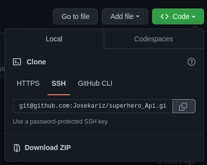
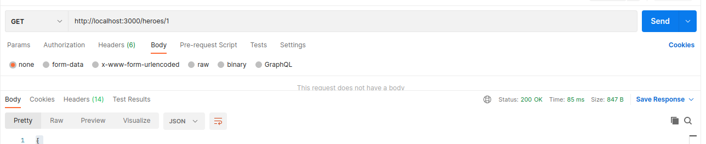

## README

# SuperHero Api  

# Instructions for set up 
  * Clone this repository. 
 
      

  To get set up, run:

```console
$ bundle install 
$ rails db:migrate db:seed
$ rails s
```
This will download all the dependencies for our app and set up the database.
And additionally start the rails server in your console.

# Model Relationships

 - A `Hero` has many `Power`s through `HeroPower`

- A `Power` has many `Hero`s through `HeroPower`

- A `HeroPower` belongs to a `Hero` and belongs to a `Power`


# Testing routes

 Open postman and run the following routes.
   


  #  GET /heroes


 http://localhost:3000/heroes

* The expected results is:

```
[
    {
        "id": 1,
        "super_name": "Ms. Marvel",
        "name": "Kamala Khan"
    },
   
    {
        "id": 2,
        "super_name": "One Punch man",
        "name": "Saitama"
    },
   
    {
        "id": 3,
        "super_name": "Superboy",
        "name": "Jonathan Kent"
    },
   
    {
        "id": 4,
        "super_name": "Stargirl",
        "name": "Brec Bassinger "
    }
]
```


  
  #  GET /heroes/:id


 http://localhost:3000/heroes/:id

* The expected results is:

```

{
    "id": 1,
    "super_name": "Ms. Marvel",
    "name": "Kamala Khan",
    "powers": [
        {
            "id": 1,
            "name": "super strength",
            "description": "gives the wielder super-human strengths"
        }
    ]
}

```

If the `Hero` does not exist, return the following JSON data, along with

the  HTTP status code: 400

```

{   "error": "Hero not found" }

```
# GET /powers
http://localhost:3000/powers

* The expected results is:

 ```
 
 [
    {
        "id": 1,
        "name": "super strength",
        "description": "gives the wielder super-human strengths"
    },
    {
        "id": 2,
        "name": "Fighting",
        "description": "His abilities mainly consist of physical abilities magnified to an immeasurable degree: strength is the true power of Saitama, with speed, stamina, and durability being mere side-effects"
    },
    {
        "id": 3,
        "name": "Super strength ",
        "description": "A mighty and strong boy takes after his father in more than one way."
    },
    {
        "id": 4,
        "name": "Freeze breath ",
        "description": "This power has most villans chillled out and relaxed!!!"
    },
    {
        "id": 5,
        "name": "Flying rod",
        "description": "Being one of the youngest heros in the Dc world this power has potential to grow to immense strength"
    }
]

```

# GET /powers/:id
 http://localhost:3000/powers/:id


If the `Power` exists, return JSON data in the format below:

```

{
    "id": 1,
    "name": "super strength",
    "description": "gives the wielder super-human strengths"
}

```

If the `Power` does not exist, return the following JSON data, along with

th HTTP status code: 400

```
{
  "error": "Power not found"
}

```

 # PATCH /powers/:id
 http://localhost:3000/powers/:id


This route should update an existing `Power`. It should accept an object with

the following properties in the body of the request:

```
{

  "description": "Updated description"
}

```

If the `Power` exists and is updated successfully (passes validations), update

its description and return JSON data in the format below:

```

{

  "id": 1,
  "name": "super strength",
  "description": "Updated description"
}

```

If the `Power` does not exist, return the following JSON data, along with

the appropriate HTTP status code:

```
{
  "error": "Power not found"
}
```

If the `Power` is **not** updated successfully (does not pass validations),

return the following JSON data, along with the appropriate HTTP status code:

```
{
  "errors": ["validation errors"]
}
```

# POST /hero_powers

This route should create a new `HeroPower` that is associated with an

existing `Power` and `Hero`. It should accept an object with the following

properties in the body of the request:

```
{
  "strength": "Average",
  "power_id": 1,
  "hero_id": 3
}
```

If the `HeroPower` is created successfully, send back a response with the data

related to the `Hero`:

```
{

  "id": 1,
  "name": "Kamala Khan",
  "super_name": "Ms. Marvel",
  "powers": [

    {
      "id": 1,
      "name": "super strength",
      "description": "gives the wielder super-human strengths"

    },

    {
      "id": 2,
      "name": "flight",
      "description": "gives the wielder the ability to fly through the skies at supersonic speed"
    }
  ]
}

```

If the `HeroPower` is **not** created successfully, return the following

JSON data, along with the appropriate HTTP status code:

```
{
  "errors": ["validation errors"]
}
```

# Thats it. The SuperHero API is done.